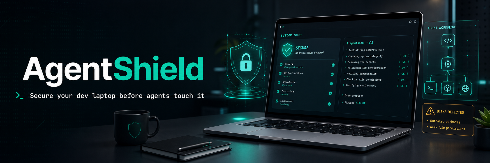

# AgentShield



**Secure your dev laptop before agents touch it.**

AgentShield is a local-first security auditor for developers using AI coding agents, terminal agents, IDE assistants, and automation-heavy workflows. It scans the places where agentic tools commonly inherit power: environment variables, shell history, SSH keys, Git config, secret-bearing dotfiles, global developer packages, and project repositories.

It never uploads data, never remediates without you, and redacts sensitive evidence in reports.

## Features

- Exposed environment variable audit with secret-name and high-entropy detection
- AI agent tool exposure checks for local Codex, Claude, Cursor, MCP, and similar config files
- Risky shell history scanner for pasted tokens, `curl | sh`, plaintext passwords, broad chmods, and credential-bearing URLs
- SSH audit for weak file permissions, unencrypted private keys, missing `known_hosts`, and unsafe client config
- Git global config audit for plaintext credential helpers, disabled SSL verification, tokenized remotes, and unsafe SSH commands
- Secret-bearing file audit for `.env`, `.npmrc`, `.pypirc`, `.netrc`, AWS credentials, Docker auth config, and GitHub CLI hosts
- Global package inventory for npm, pip, and pipx, with warnings for suspicious package names and large global attack surfaces
- HTML, JSON, Markdown, and SARIF reports suitable for local review, CI artifacts, and code scanning dashboards
- CI-friendly failure thresholds with `--fail-on`
- Baselines for adopting AgentShield gradually and failing only on new findings
- Team policy files for ignored finding IDs, severity overrides, trusted packages, and package-count thresholds
- Remediation recipes with safe commands and manual steps in JSON, Markdown, and HTML reports
- Composite GitHub Action support for CI usage
- Optional repository scanning for committed secret files, missing `.gitignore` protections, tokenized remotes, and repo-local agent config

## Install

```bash
python3 -m pip install -e .
```

No runtime dependencies are required.

## Quick Start

```bash
agentshield scan --output reports/agentshield.html --json-output reports/agentshield.json
```

Generate every report format:

```bash
agentshield scan --format all --output reports/agentshield.html
```

Audit another home directory, such as a test fixture or mounted workstation profile:

```bash
agentshield scan --home /Users/alex --format all
```

Audit a repository alongside the workstation:

```bash
agentshield scan --repo /path/to/repo --format all
```

Use it in CI without failing unless a high-severity issue is found:

```bash
agentshield scan --fail-on high --json-output agentshield.json
```

Create a baseline for existing findings, then suppress those known findings in future scans:

```bash
agentshield scan --write-baseline .agentshield-baseline.json --format all
agentshield scan --baseline .agentshield-baseline.json --fail-on medium
```

Create and use a team policy:

```bash
agentshield init-policy --output .agentshield-policy.json
agentshield scan --policy .agentshield-policy.json --fail-on medium
```

Use the GitHub Action:

```yaml
- uses: 0xtar0/AgentShield@main
  with:
    fail-on: high
    format: all
    min-severity: low
    skip-shell-history: "true"
```

## Example Output

```text
AgentShield audit complete
Risk score: 68/100
Findings: 2 critical, 4 high, 5 medium, 7 low, 3 info
HTML report: reports/agentshield.html
JSON report: reports/agentshield.json
```

## What AgentShield Checks

| Area | Checks |
| --- | --- |
| Environment | Secret-like names, token patterns, high-entropy values, unsafe PATH entries |
| Agent tools | Installed agent CLI inventory, readable/writable agent configs, secret-like agent config values, MCP env bridges |
| Shell history | API keys, exported secrets, passwords in commands, credential URLs, `curl | sh`, `chmod 777` |
| SSH | Private key permissions, unencrypted keys, `.ssh` permissions, unsafe `StrictHostKeyChecking`, missing `known_hosts` |
| Git | `credential.helper=store`, `http.sslVerify=false`, tokenized URL rewrites, unsafe SSH commands |
| Secret files | `.env`, `.npmrc`, `.pypirc`, `.netrc`, AWS credentials, Docker auth, GitHub CLI hosts |
| Global packages | npm, pip, pipx, Homebrew, pnpm, cargo, and gem inventory, suspicious names, broad global package footprint |
| Project | Sensitive files in the repo tree, missing `.gitignore` protections, tokenized remotes, repo-local agent/MCP env bridges |

## Privacy Model

AgentShield is intentionally local:

- No network calls
- No telemetry
- No dependency downloads at runtime
- Secret values are redacted before being written to reports
- Scans are read-only

## CLI

```text
usage: agentshield scan [options]

options:
  --home PATH                 Home directory to audit
  --repo PATH                 Optional repository path to scan
  --output PATH               HTML report path
  --json-output PATH          JSON report path
  --markdown-output PATH      Markdown report path
  --sarif-output PATH         SARIF report path
  --format html|json|md|sarif|all
                              Report format convenience switch
  --skip-shell-history        Skip shell history scanning
  --skip-global-packages      Skip npm/pip/pipx inventory
  --max-history-bytes N       Bytes to read from the end of each history file
  --baseline PATH             Suppress findings listed in a baseline JSON file
  --write-baseline PATH       Write a baseline JSON file from the full audit
  --policy PATH               Apply a team policy JSON file
  --min-severity LEVEL        Only report findings at this severity or higher
  --fail-on LEVEL             Exit non-zero on low|medium|high|critical findings

usage: agentshield init-policy [options]

options:
  --output PATH               Policy output path
  --force                     Overwrite an existing policy file
```

## Development

```bash
python3 -m unittest discover -s tests
python3 -m agentshield scan --skip-global-packages --format all
```

## Roadmap

- VS Code task integration
- Policy docs with common maintainer profiles
- Additional package managers: uv tools, mise, asdf

## License

MIT
